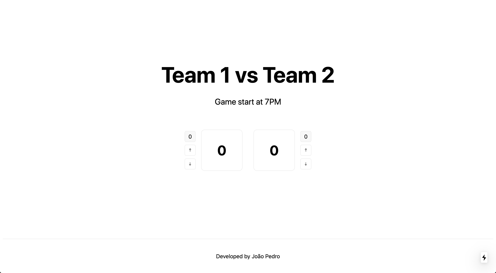

# Volley

Volley is a volleyball scoreboard application developed with Next.js to a college project.



## Getting Started

First, clone this repository and install the dependencies with `npm install` or `yarn`.

Then you can start the development server.

```bash
npm run dev
# or
yarn dev
```

Open [http://localhost:3000](http://localhost:3000) with your browser to see the result.

## Run Jest Tests

```
npm test
```

_ps: The best way to test an application like this is by doing e2e test with Cypress.
As I didn't have the time to do it, I have just used `jest` with `testing-library` and created small tests to check if title, winner and other things were being displayed._
